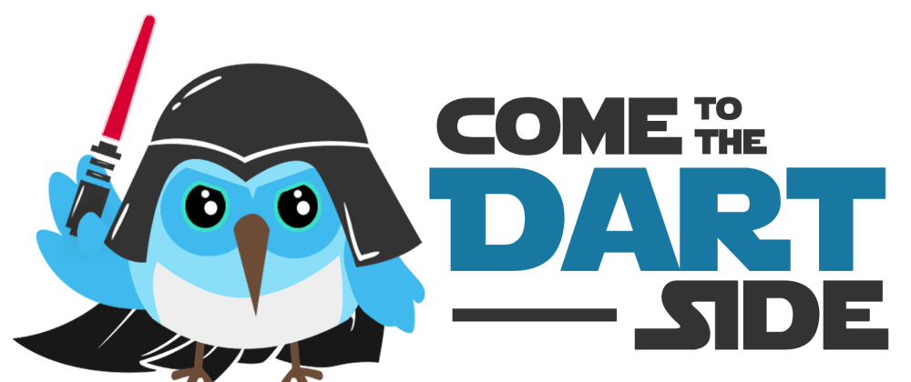

  

<h1 align="center">Hi 👋, I'm Hussam</h1>

<h3 align="center">Software Engineer & Mobile Software Developer</h3>

  

  

- 🔭 I’m currently working on [Passengers](https://github.com/husssam12/passengers)

- 🌱 I’m currently keep learning **Mobile Software Engineering & ML/AI**

- 👯 I’m looking to collaborate on [Flutter Bots](https://github.com/flutterbots/flutterbots)

- 💬 Ask me about **Flutter, Dart, Android**

- 📫 How to reach me **hussamhajjar.it@gmail.com**

- 📄 Know about my experiences [Resume](https://docs.google.com/document/d/1iDkbRh0Q7VDFu-H7vgJEi3z9s4j86QBkM9v9Q7KIy3g/edit?usp=sharing)

- ⚡ Fun fact **Many owners of large tech companies loved video games as kids**

<h3 align="left">Connect with me:</h3>

<h3 align="left">Languages and Tools:</h3>

        

&nbsp;

